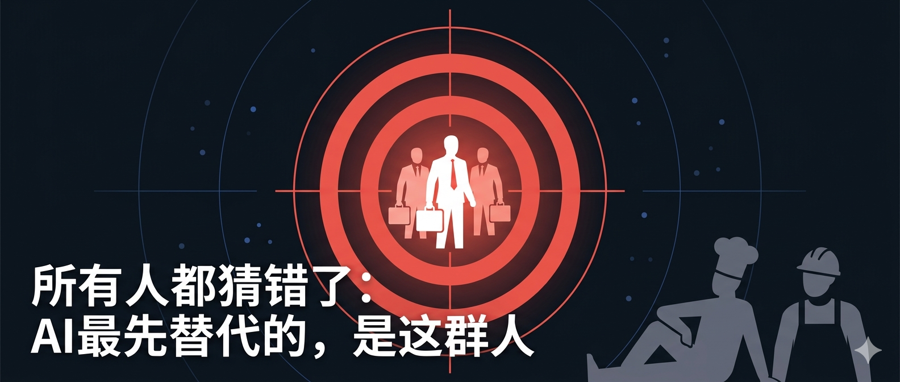
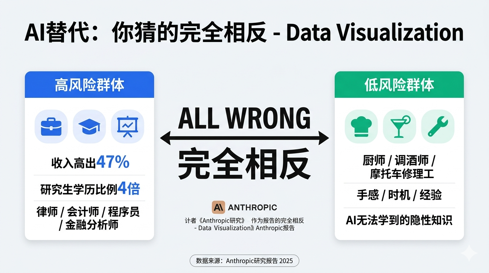
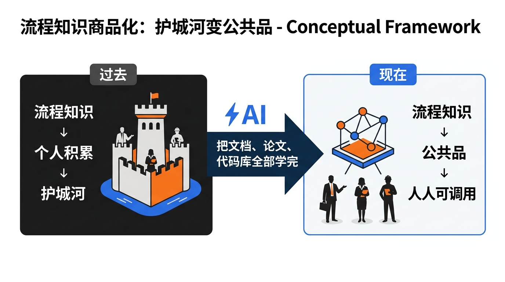
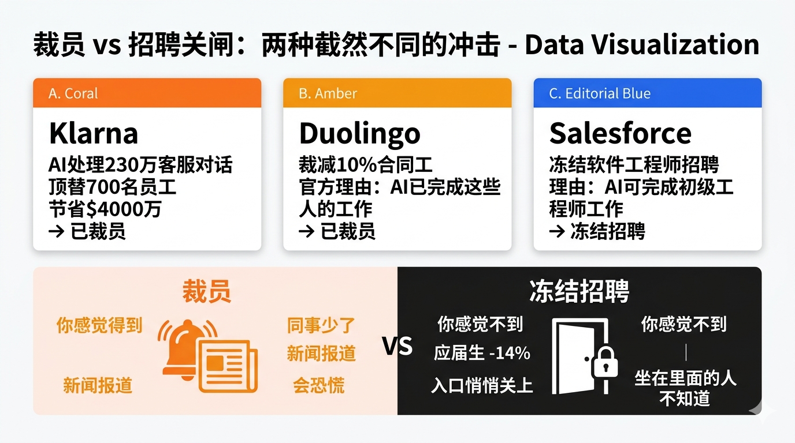
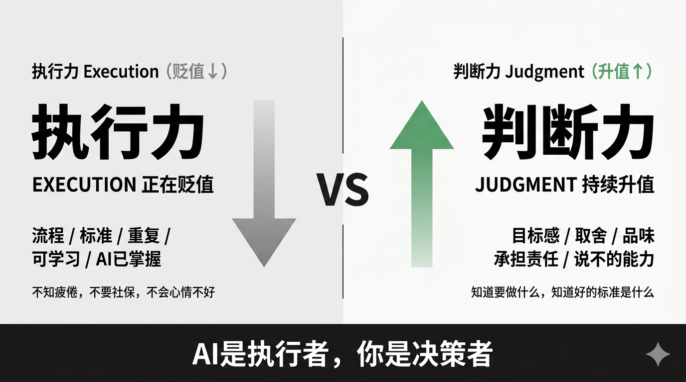

# 所有人都猜错了：AI最先替代的，是这群人

_预计阅读时间：8分钟_

---

我问过很多人同一个问题。

AI会先替代哪些工作？

大多数人的答案差不多：流水线工人、快递员、收银员、司机。

这个答案听起来很有道理。这些工作重复、标准化，好像最容易被机器取代。

然后Anthropic出了一份报告，把我的认知整个翻了一遍。

---

## 数据说：你猜反了

今年3月，Anthropic发布了一项研究。

他们不是在分析理论上AI能做什么，而是看实际数据，AI现在正在做什么，正在渗透哪些工作。

结论出来的时候，我看了两遍，确认自己没看错。

风险最高的那群人，平均收入比风险最低组高47%。

风险最高的那群人，研究生学历比例是风险最低组的4倍。

而风险最低的那群人是谁？厨师，调酒师，摩托车修理工。

这完全不是我们想象中的那张图。

所有人都以为AI先替代体力劳动者。数据说：完全相反。

---

## 为什么会这样

要理解这件事，你需要先理解一个概念，叫做流程知识。

什么叫流程知识？就是这件事该怎么做的知识。

合同该怎么审查，是流程知识。财务报告该怎么出，是流程知识。代码该怎么写，是流程知识。数据该怎么分析，是流程知识。

这些知识，过去要花几年甚至十几年去积累。积累的过程本身就是门槛，就是护城河。

AI做了一件事：它把所有写进文档、写进论文、写进代码库、写进法律案例的流程知识，变成了公共品。

你用豆包或者Kimi问过专业问题就知道，它能给你一个听起来非常专业的回答。

这不是AI在冒充专家。这是因为它确实学过，而且它读过的东西，比任何一个活着的人都多。

律师、会计师、程序员、金融分析师——他们的护城河建立在流程知识上。

现在，这道护城河没了。

而厨师的手感，调酒师对时机的把握，修车师傅听异响就能判断哪里坏了——这些东西在文档里找不到，AI学不到。

这不是说体力劳动更高级，是说有一些知识，AI吃不到。

白领的护城河，反而比蓝领薄。

---

## 但最可怕的信号，不是裁员

让我先给你几个你可能已经知道的例子。

Klarna，全球最大的先买后付平台，AI一个月内处理了230万个客服对话，顶替了700名员工的工作量，节省了4000万美元。然后他们裁员了。

Duolingo，2024年裁掉了10%的合同工，官方理由：AI已经能完成这些人的内容工作了。

Salesforce，全球最大的CRM公司，冻结了软件工程师的招聘，理由是AI已经可以完成大量初级工程师做的事情。

四大会计师事务所，2024年大幅削减初级员工招聘，理由同上。

你注意到一个细节了吗？

有几家是裁员，有几家是冻结招聘。

裁员你感觉得到。你的同事少了，你会知道，你会恐慌，新闻会报道。

但冻结招聘，你感觉不到。你身边现有的同事一个没少，工位还是那些工位，只是新毕业生进不来了，只是应届生投了几百封简历没有回音。

Anthropic的报告里有一个数字。

ChatGPT发布之后，22到25岁的应届生，在AI高暴露领域找到工作的概率，下降了14%。

不是被裁，是进不来了。

入口悄悄关上了，但坐在里面的人，大多数还不知道。

---

## 那什么是真正的护城河

Anthropic的报告还有一个数字，很多人没注意到。

30%的工作，AI暴露度为零。不是低，是零。

除了厨师、调酒师，还有一类工作：需要真实在场的信任关系，需要对具体情况作出没有标准答案的判断，需要为决策承担真实责任的工作。

一个医院的主治医生，不只是在读片、下诊断，他在告诉一个真实的人他的病情，他要处理病人和家属的情绪，他要在不确定的条件下做出选择，然后对结果负责。

AI能给你五个方案，但选哪个、为什么选、选了之后出了问题谁来负责——这是人的事。

这就是执行力和判断力的区别。

执行本身，AI已经会了。而且不知疲倦，不要社保，不会因为心情不好发挥失常。

执行力，在贬值。

但判断力，在升值。

知道要做什么，知道好的标准是什么，知道AI给出的五个方案里哪一个真正符合这个情况，知道什么时候该说不——这是AI现在做不到的事。

AI是一个能力极强的执行者，但它没有目标感，没有价值观，没有判断好坏的品味。

你有。

问题是，你有没有把这个能力当成重点去建。

---

## 最后说一件事

写这篇文章的时候，我反复想一个问题：这些话会让人绝望吗？

想了想，我觉得不会。

绝望的前提，是你相信这件事不会发生，然后它发生了。

但它正在发生。承认这件事，反而是一种清醒。

你不需要再假装这跟你无关，不需要再用我的行业有特殊性来安慰自己。

你只需要问一个真实的问题：我现在靠什么谋生？这个东西，是流程知识，还是判断力？

如果是流程知识，那你需要做一个选择。

现在，大多数人用AI，还停在最基础的用法：你问，它答，你去做。AI是工具，你是操作员。

这个阶段，AI替代的恰好就是你在做的事。

但还有另一种用法。不是让AI帮你执行，而是你来决定要做什么、好的标准是什么，让AI去跑腿——你从操作员变成指挥者。

这两种用法，表面上都是在"用AI"，本质上是完全不同的两种人和AI的关系。

从第一种到第二种，不是换个工具，是换一套思维方式。大多数人不是不想跨，是不知道怎么跨。

下一篇，我来讲这个过程。

---

