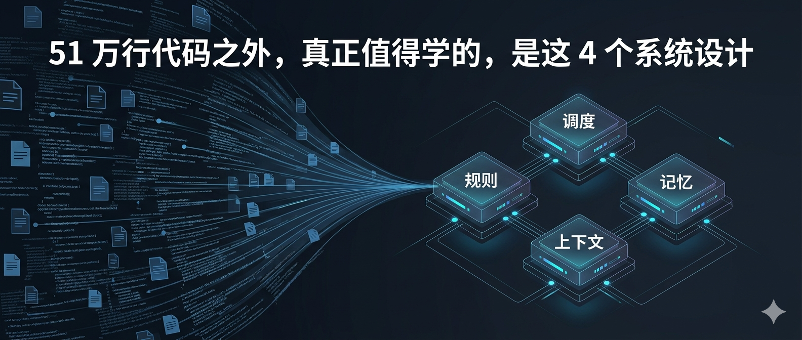
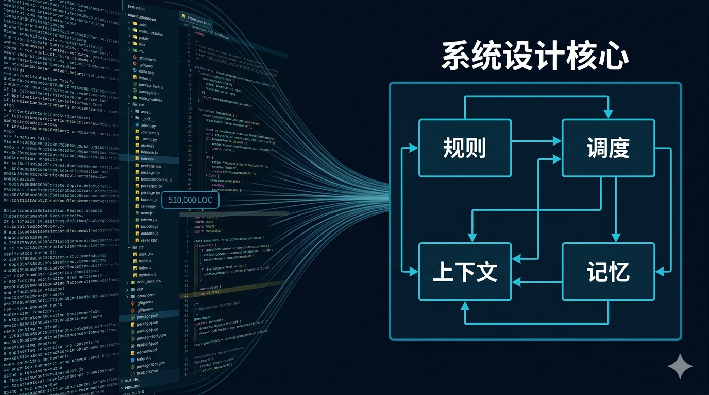
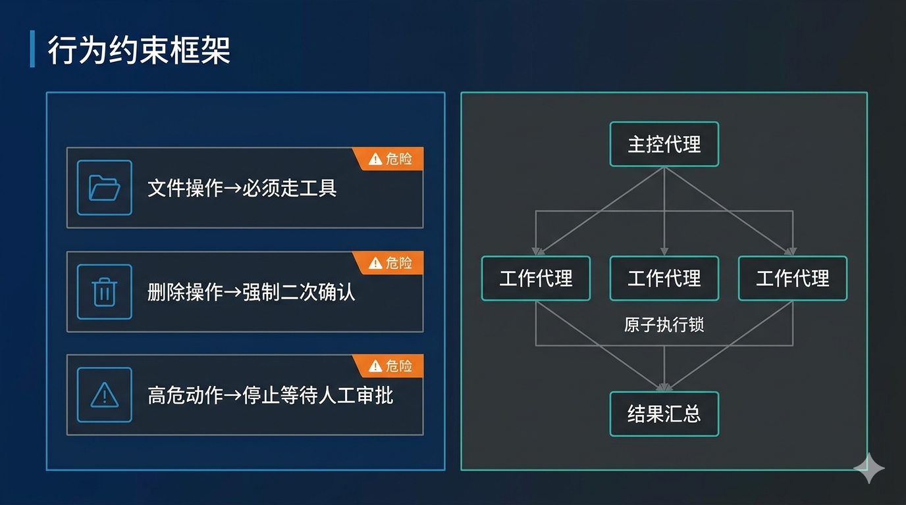
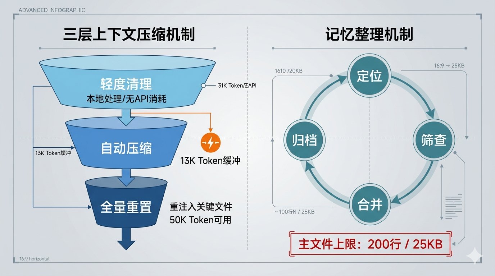
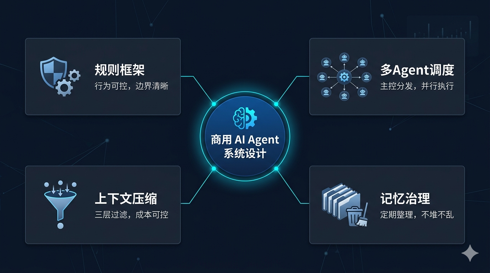

# 51 万行代码之外，Claude Code 真正值得学的，是这 4 个系统设计

上周，有人发给我一段文字，说是从 Claude Code 泄露的源码里扒出来的 system prompt。

「你看，就这？秘密就在这里了。」

我理解这种兴奋。1900 个文件，51 万行代码，乍一看确实像是打开了一个黑盒子。

但如果真的只是去找那几段 prompt、然后说「学到了」，其实有点像去一家米其林餐厅，唯一带回家的东西是菜单。

**真正值钱的，是厨房里那套系统。**

所以这篇文章不想复述别人已经写过的「Claude Code 到底用了什么 prompt」，我想聊的是：从这次代码被集中讨论这件事里，真正值得学的 4 件事是什么。

---

## 1. AI 产品的第一道门不是智能，是规矩

你可能会说——Claude Code 能干活，不就是因为模型强嘛？

嗯，对，也不对。

模型强是基础，但让一个 AI 工具真正能在生产环境跑起来，靠的不是聪明，靠的是：**它会不会守规矩。**

举个很具体的场景：

Claude Code 在执行任务时，如果它判断某个操作有破坏性——比如删文件、改配置——它不会自己直接做，而是先停下来问你：「这个操作我需要确认一下。」

这不是因为它不会，而是因为**系统规则规定了它不能直接做**。

从源码里能看到很具体的设计：
 行终端命令绕过
- 数据删除类操作强制二次确认，不能跳过
- 什么时候要停下来交还给人，什么时候可以自己继续跑——都写死在规则里了

这些不是 prompt 技巧，是**行为约束框架**。

真正做过 AI 落地的人都知道：模型不管多强，如果行为不可控，到了真实业务里没人敢用。

第一道竞争壁垒，往往不是模型本身，而是**谁把规则设计得更可靠**。

---

## 2. 一个 AI 干不了的事，靠分工来解决

AI Agent 这个词现在被用滥了。

但我想问一个更具体的问题：你见过的那些 Agent，它们是真的在「协作」，还是只是一个聊天机器人换了个名字？

真正复杂的任务长这样：

先读你的代码库 → 定位出问题的文件 → 理解上下文 → 制定修改方案 → 执行修改 → 跑测试验证 → 整合结果汇报给你。

这一套流程，让一个单一的 AI 去完成，很快就会出问题：上下文太长、任务太重、一步出错全盘崩。

Claude Code 真正值得看的地方，是它背后有一套任务调度机制：

- 主控代理负责拆解任务，分发给多个工作代理并行执行
- 高危操作走「权限队列」——工作代理不能自己决定，必须向主控申请审批
- 「原子执行锁」机制防止多个代理同时抢占同一个任务，互相打架
- 所有代理共用一个记忆池，信息共享，但各自执行边界清晰

说白了，这就是一套**公司组织架构的 AI 版本**。

CEO 不会亲自敲每一行代码。好的组织，是设计好谁负责判断、谁负责执行、谁来汇总，然后让这套系统跑起来。

很多团队现在做 Agent，真正的瓶颈不是模型不够强，而是根本没有任务拆解和协作的系统设计。

---

## 3. 上下文越堆越长，不是优势，是隐患

这是这次讨论里我觉得最被低估的一点。

大家对「长上下文」的理解，通常停在：「谁支持的 token 越多，谁越厉害。」

但我接触过一些做 AI 工具的团队，他们遇到的真实问题是：**上下文一长，任务就开始飘。**

原因很简单——你把太多东西塞进去，模型反而抓不住重点。

更糟的是，token 消耗直接对应成本。一个跑了一半的长任务，token 已经用了大半，最后还跑崩了。

在压缩之前，还有更基础的一层控制：文件去重。

没改过的文件直接跳过，不重复加载；工具运行输出的内容太长，直接写进本地磁盘，上下文里只保留一个短预览和引用链接，不占位置。

这两件事做好，很多长任务根本不会到需要压缩的程度。

真正需要压缩时，源码里有一套三层机制：

**第一层**：日常轻度清理——本地缓存冗余内容，自动删掉没用的工具日志，不消耗 API。

**第二层**：临近上限时自动压缩——预留 13000 Token 安全缓冲，触发后最多生成 20000 Token 的总结文本；如果压缩连续失败 3 次，直接熔断，不再重试，避免死循环。

**第三层**：全量重置——把整段会话压缩成摘要，重新注入最近频繁用到的文件（单文件上限 5000 Token）、当前执行计划和技能配置，压缩后保证剩余 50000 Token 可用空间。

这套逻辑，跟操作系统的内存管理其实高度相似。

一个 AI 工具能不能跑长任务、跑复杂任务，核心竞争力不是上下文有多大，而是**能不能把有限空间用得精。**

---

## 4. 记忆不是越多越好，是越干净越好

「让 AI 记住一切」——这句话你可能听到过不止一次。

听起来很强，但真正做过长期 Agent 系统的人都知道：**记忆最大的敌人，不是遗忘，是污染。**

想象一个每天运行的 AI 助手，它不断把信息往记忆里堆：今天你说了什么、昨天有什么结论、上周有什么偏好……

堆到一定程度，问题来了：

- 同一件事被记了五遍，版本还不一致
- 你的偏好变了，但旧记忆还在影响它的决策
- 真正重要的信息被噪音淹没，它找不到

源码里的记忆其实分两层。

**第一层是会话内的工作记忆**。每次对话，系统会在后台维护一份结构化的 Markdown 文档，里面分成这些区块：

> 会话标题 / 当前状态 / 任务说明 / 相关文件与函数 / 工作流 / 报错与修正记录 / 经验教训 / 关键成果 / 工作日志

这其实就是一份人类程序员的工作笔记。Claude Code 用这种方式，在每次对话里给自己维持一个清晰的工作状态，不依赖单纯的上下文堆积。

**第二层是跨会话的长期记忆整合**，后台静默运行，触发需要同时满足 4 个条件：

- 距上次整合已满 **24 小时**
- 新增会话不少于 **5 组**
- 没有其他整合进程在跑
- 距上次扫描已满 **10 分钟**

触发之后，走四个步骤：定位旧记忆 → 筛查日志 → 合并纠错 → 精简归档。整个过程对用户无感知。

最后有一个硬约束：**主记忆文件不得超过 200 行、25KB**。超出就压缩，不让它无限膨胀。

这其实已经是一个**运维问题**，不是模型问题。

真正成熟的 Agent 产品，记忆不是一个功能点，而是一套持续维护机制。就像你的硬盘，不是存满了就好，是要定期整理才能保持效率。

---

## 这 4 件事拼起来，才是一个能真正干活的 AI 系统

如果你今天也在做 AI 产品，或者想把 AI 接进真实业务流程，这 4 个问题值得认真对照：

1. **可控性**：你的 AI 系统有没有行为边界？还是模型说什么就是什么？
2. **调度能力**：你有没有真正的任务拆解设计？还是所有事情压给一个 agent 扛？
3. **上下文管理**：你有没有主动管理 token 消耗和信息密度？还是任由它堆？
4. **记忆治理**：你有没有记忆整理机制？还是在不断往里塞？

这 4 个问题，是我看完这次讨论后，觉得最值得认真问自己的。

因为从长期看，AI 产品的竞争不在谁的模型更聪明，而在谁的系统设计更成熟。

**51 万行代码，你能从里面看到什么，取决于你带着什么问题去看。**
