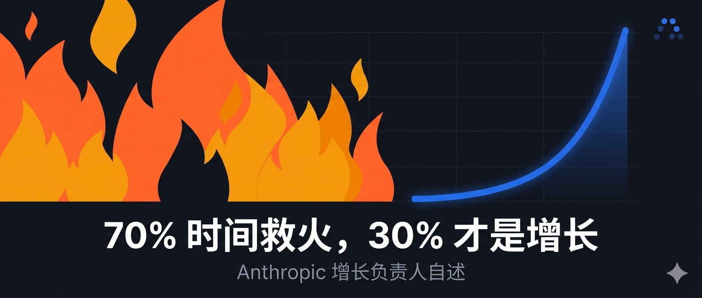
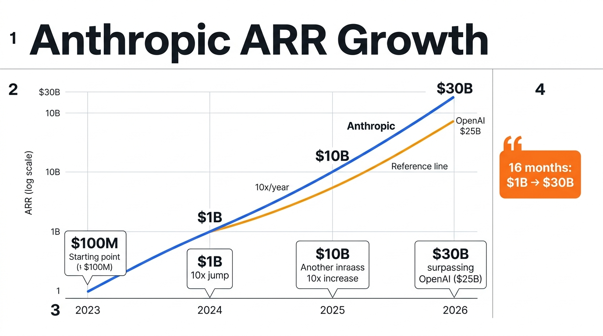
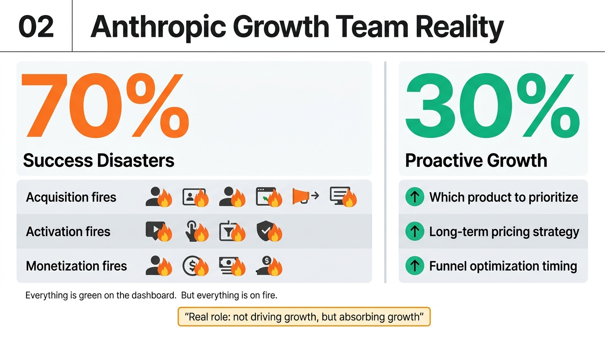
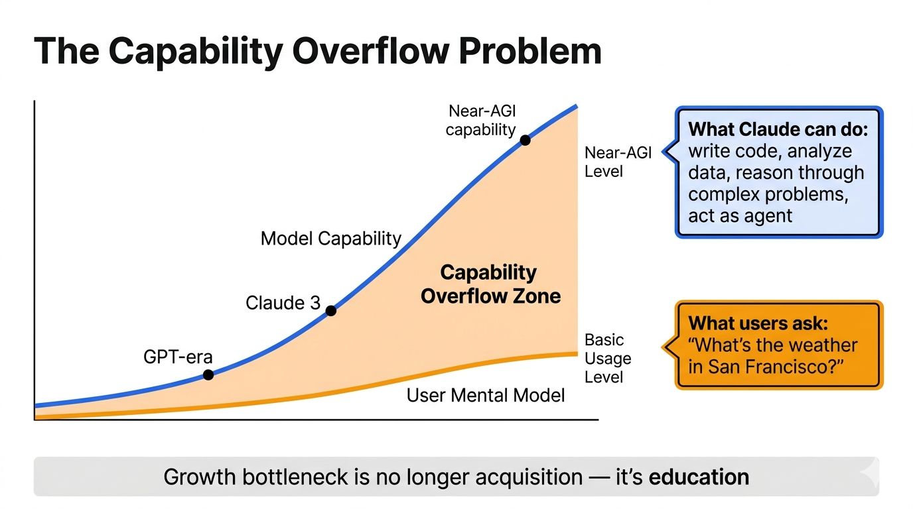
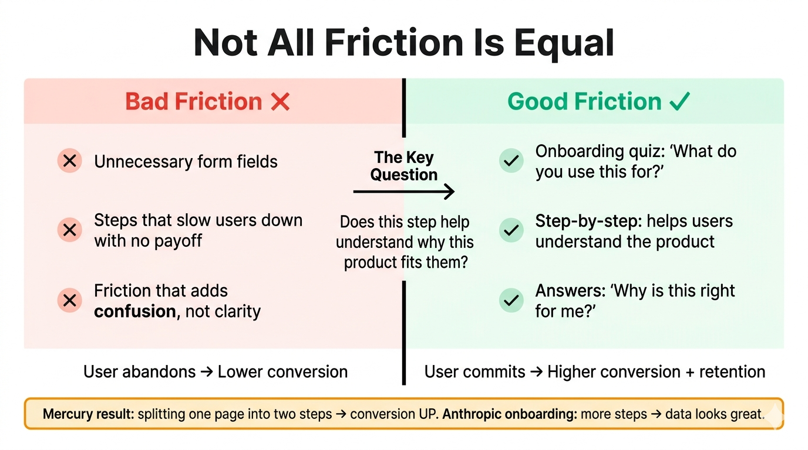

# 70% 时间救火，30% 才是增长——Anthropic 增长负责人自述

两天前，刷到了一期播客。

被访者是 Amol，Anthropic 的增长负责人。

主持人 Lenny 问他，你在 Anthropic 负责增长，每天在忙什么。

Amol 的回答是，70% 的时间在救火。

。。。

等一下，70% 救火？你是增长负责人啊。你不应该在设计漏斗、跑 A/B 测试、优化转化路径吗？

他说，在 Anthropic 不行。

增长太快了，太多东西在着火。

---

先说一下背景。

Anthropic 这一两年的增速，真的有点超出认知边界。

2023 年，从 0 到 1 亿美元 ARR。

2024 年，从 1 亿到 10 亿。

2025 年，从 10 亿到接近 100 亿。

然后到最近，已经超过 300 亿了，超过了 OpenAI 的 250 亿。

16 个月，10 亿到 300 亿。

这个速度快到他们内部已经不用线性图了，全公司默认用对数坐标来看业务。线性图里，前面一段几乎是平的，然后突然飞天，根本没法看。

Amol 说，我们的心理坐标系就是这样的，全公司都在用指数视角思考问题。

Dario 每年都在推那个让所有人觉得「这怎么可能做到」的激进版本目标。

结果都实现了。

---

回到那 70% 的救火。

Amol 管它叫「成功灾难」，success disasters。

说的是，事情发展太好了，反而导致其他地方开始崩溃。

每个经历过高速增长的公司都懂这种感觉。获客、激活、变现，每个环节都在着火。从数据上看，曲线全是绿的，一切向好，但你每天上班的感受是今天又有什么东西爆了，先把火扑掉。

他说，你需要不断地把自己从日常紧急事务里抽出来，提醒自己，我们在解决的是好问题。

然后剩下那 30%，才是真正主动的增长工作，比如优先推哪个产品、定价策略怎么设计、新产品什么时候开始系统性优化漏斗。

我听到这个比例的时候挺意外的。

一般意义上的「增长负责人」，应该是增长策略的核心设计者。但 Amol 描述自己工作的方式，更像一个救灾队队长，顺便做一点传统意义上的增长。

---

为什么会这样？

因为 Anthropic 的增长，根本不是增长团队推出来的。

这话是 Amol 亲口说的。

他说，真正驱动增长的，是模型本身的能力。是研究团队、推理团队、还有 Claude Code 这样的产品团队，他们才更值得拿走大部分功劳。

增长团队做的，不是「拉动增长」，是「承接增长」。

你想想这个区别有多大。

传统增长逻辑是，产品做出来了，用户不来，你去拉。你投广告、做裂变、优化 SEO、设计 referral 机制，把用户推进漏斗。

但在 Anthropic 的语境里，是用户在主动涌进来，涌得太快，你要做的是让整个系统不崩。

如果模型没有指数级的能力提升，增长团队的策略再精细，也只是边际优化。

这不是谦虚，是事实。

---

但这里有一个悖论，我觉得是整个访谈里最有意思的部分。

Amol 管它叫「能力溢出」。

模型能力提升太快，产品跟不上，用户的心智更跟不上。

Claude 现在能做的事情，绝大多数用户根本不知道。

他说，就算你有接近 AGI 能力的模型，如果用户打开之后只是问一句「今天天气怎么样」，他根本体验不到那个模型的价值。

而且这个问题在 Anthropic 内部也一样存在。新模型发布了，你如果不刻意花时间去探索，就不知道它多了什么能力，就用不上。

所以增长的核心问题，已经不是拉新了。

是教育用户，让用户知道这个模型能做什么，帮他们真正用起来。

他们现在做的一件事是，支持用户从 ChatGPT 导入记忆，解决冷启动问题。让 Claude 一上来就知道你是谁、你的偏好是什么，然后直接导向最适合你的功能。

Amol 说，AI 产品激活最难的地方不是技术实现，是模型能力在指数级提升，但用户的使用心智没有同步升级。每当你搞清楚怎么引导用户用上某个能力，下一代模型可能已经来了，能力又变了，前面的那些学习几乎全失效。

所以这件事很难持续跟进。

但某种意义上，这也是 AI 产品和传统产品最本质的差异，你在追一个一直在跑的目标。

---

顺着激活这个话题，他说了一个反直觉的东西。

增加摩擦，反而可能提升转化。

这个结论在 MasterClass、Mercury 还有 Anthropic 内部都被验证过。

你以为的增长优化是，把所有步骤砍掉，让用户最快到达价值时刻。越少摩擦越好。

但他说，很多时候这是错的。

Mercury 做过一个实验，把 onboarding 流程里的表单从一个页面拆成两步，降低认知负担，转化率反而上去了。更极端的是，他们整个团队有一个季度，完全不看指标，只打磨 onboarding 的体验质量。那个季度是 Amol 在加入 Anthropic 之前影响最大的一次增长项目之一。

他的结论是，好的摩擦和坏的摩擦是两种东西。

坏的摩擦，是让用户觉得烦、觉得没用的步骤。

好的摩擦，是帮助用户理解「这个产品为什么适合我」。只要某个步骤能回答这个问题，即使增加了步骤，转化率也会上去，因为你把对的用户引向了对的功能。

这个逻辑还有复利效应。

你更了解用户是谁、为什么来，这些信息可以用在后续的精准推荐上，可以用在流失后的相似人群投放上。理解用户的那一步，是一个持续放大的增长资产，只要你在后续流程里用好它。

---

然后是关于怎么分配团队资源的部分，也挺反直觉。

Amol 的团队，大概 70% 时间做大项目，30% 做小优化。

在传统增长团队，这个比例通常是反过来的，大量时间跑小实验，偶尔做一个大项目。

他说，在 Anthropic 不这么做，是因为产品本身的价值是指数级增长的。

过去那种逻辑，产品价值相对稳定，小优化能吃到很大一块增量，因为大家的起跑线差不多。但现在，模型能力每一两年翻一个数量级，原来不存在的市场突然出来了。

比如 Agentic Coding，一两年前还是一个没有市场的概念，现在这个市场体量已经超过了当时整个 AI 编程市场。

在这种情况下，你把时间花在把按钮颜色从蓝色换成绿色上，等你跑完实验，市场已经变了。

所以他们选择押大赌注，把更多时间放在那些可能带来 10 倍增量的项目上。

那个 Claude 的 Chrome 插件就是例子。增长团队做的，但更像偏研究型的产品。现在这个插件已经成为 CoWork 和 Claude Code 多个场景的底层能力。在其他公司，他大概率不会做这个决定。

---

最后说一个我自己觉得挺有意思的事情，CASH 项目。

全名是 Claude Accelerates Sustainable Hypergrowth。

就是在探索，能不能用 Claude 自动化增长实验本身。

把一次完整的增长实验拆成四个环节，发现机会、构建方案、测试上线、分析总结，然后评估 Claude 在每个环节能做多少。

Amol 说，Opus 4.5 之前他们一直看不到效果，到 Opus 4.6 才觉得方向是对的。

现在是小规模跑着，主要做文案调整和 UI 微调。

他的描述是，你按下开始，它就帮你「印钱」。

成功率大概相当于一个工作 2-3 年的初级 PM，离资深还有差距，但几个月前这完全不可行。

这条逻辑挺值得想一想，AI 正在把增长这个职能本身也吃掉。

不是说 PM 会消失，而是大量执行性的工作，会越来越不需要人来做。剩下的，是判断和对齐，还有那种需要六个人坐在会议室里争论的部分。

Amol 说这话的时候，主持人接了一句，「等实现 AGI 了，可能还是很难让六个人在会议室里达成一致。」

我觉得这话挺真实的。

---

对我们来说，从这次访谈里能拿走什么？

我说一点自己的感受。

Amol 说的那个「能力溢出」问题，我觉得是真的。

如果你在用 Claude Code 做项目，或者用 Claude 做内容，你真的感受得到，最近几个版本每次更新，有些事情突然就变得可能了。不是渐进的，是跳跃的。

而这种跳跃带来的问题，确实是你不知道它又多会了什么。

我自己的习惯是，每次大版本出来，先花时间专门去探索，问它一些之前会错的问题，或者尝试之前不可行的用法，更新一下自己对它能力边界的认知。

不然你就会一直用三个月前的那个版本的脑子去用它，可能永远用不到那个最值钱的功能。

还有那个「好的摩擦」的逻辑，我觉得对做内容的人也有参考价值。

很多人会想，要不要把内容做得更「无脑可消费」，降低阅读门槛，让人更容易点进来。

但 Amol 说的是另一套，好的摩擦帮助用户判断「这个对我有没有用」，筛选出真正想留下来的人，这个过程反而对长期价值更重要。

你是要 10 万个看完就走的人，还是要 1 万个真的觉得有用的人。

对于想把内容做成个人 IP 的，我始终觉得后者更值得。

---

对了，顺便说一个细节，Amol 是怎么进 Anthropic 的。

他是 Claude 的重度用户，有一天觉得这个产品很好，但明显缺一个增长团队。于是直接给 CPO Mike Krieger 发了一封冷邮件，大意是，你们急需增长团队，我们聊聊。

Mike 回了，后来他入职了，成了第一个通过冷邮件被招进来的 PM。

这个故事我不是说去给 Anthropic 高管发邮件，而是说，这类公司的人，对真正感兴趣的东西是会回应的。

你如果真的深入研究过他们做的事，有自己的判断，表达出来，可能比投一百份简历管用。

---

就聊这些了。

这期播客内容挺多，这篇只选了我觉得最有意思的几个点。如果你对完整访谈感兴趣，去搜 Lenny's Podcast，Amol Waishampayan 那期。

以上，既然看到这里了，如果觉得不错，随手点个赞、在看、转发三连吧，如果想第一时间收到推送，也可以给我个星标⭐～

谢谢你看我的文章，我们，下次再见。

> / 作者：小羊肖恩
