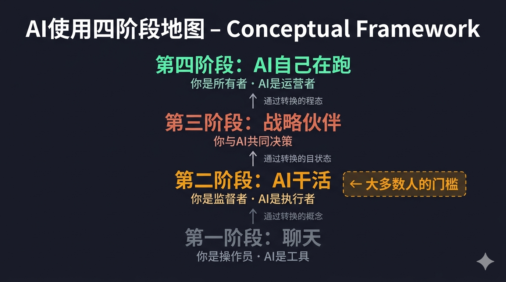
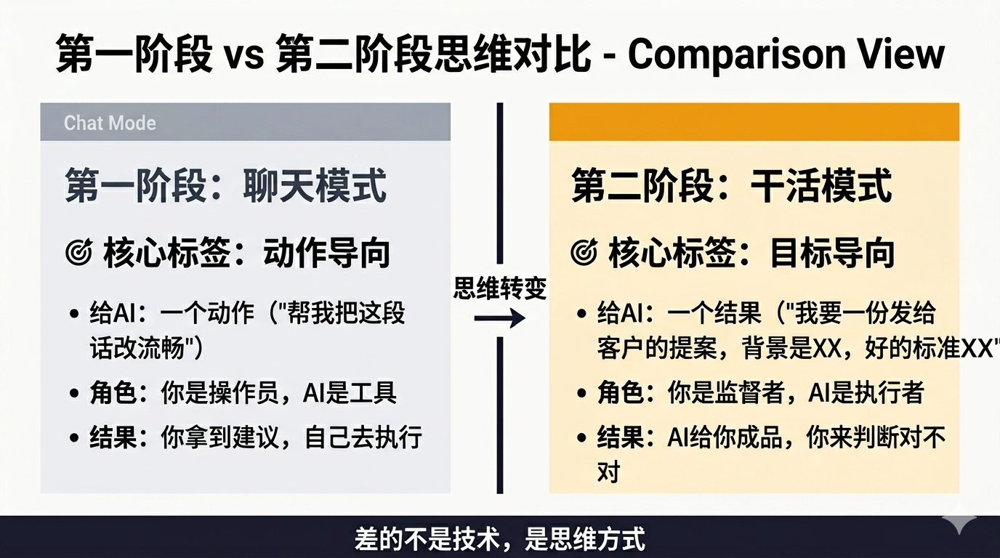

# 你以为自己在用AI，其实只是在聊天

_预计阅读时间：9分钟_

---

去年，有个做电商的朋友找我喝咖啡。

她不懂技术，连Excel公式都要百度，更别说写代码。

但她给我看了手机里的东西——一个真实运转的库存预警系统，每天早上8点自动跑一遍，把要断货的商品列出来，自动发到她微信。

我问她这个谁帮她做的。

她说Claude Code。

然后她补了一句：我就是跟它说，我有一个表，我想让它每天提醒我要补哪些货，它问了我几个问题，然后就做出来了。

我问她：你写代码了吗？

她说：我不知道什么叫写代码。我就一直跟它说话，说着说着就好了。

---

这个故事，就是我想说的核心。

这不是"会用AI"。这是真正用上了AI。

这两件事，差着整整三个阶段。

---

## 四个阶段，你在哪一层

我把人和AI的关系，分成四个阶段。

**第一阶段：你在聊天**

AI是一个更聪明的搜索引擎。你问，它答，你去做。

AI帮你找资料、帮你写大纲、帮你改一段文字。然后你自己把这些东西拼凑起来，自己执行。

AI是工具，你是操作员。

你在用豆包、Kimi、千问，或者在Claude网页版里打字聊天——你就在第一阶段。

这个阶段，AI帮你省了时间，但它不真正替你干活。它给你建议，你来执行。

**第二阶段：AI在干活**

你告诉AI你想要什么结果，AI自己想怎么做、自己执行、自己检查、直到做出来给你看。

不是给你建议，是给你成品。

帮我朋友做那个库存预警系统的，就是这个阶段。

她不需要知道代码怎么写，不需要知道定时任务怎么设置，她只需要说清楚她要什么——AI自己搞定了中间所有细节。

这个阶段，AI是执行者，你是监督者。

**第三阶段：AI是你的战略伙伴**

你不只是给AI任务，你在和AI一起想事情。

AI记得你的项目背景、你的判断风格、你的历史决策。你们在一起复盘哪条路走错了，讨论接下来的方向，AI帮你发现你没看到的风险。

这不是工具和用户的关系，更像是一个真正了解你业务的顾问。

**第四阶段：AI自己在跑**

你设定目标，AI自己规划、自己执行、自己调整，你来看结果、拍板方向。

你是所有者，AI是运营者。

这个阶段现在还在萌芽，但已经有公司在这样运转了。

---

## 大多数人在哪里

我估计，看这篇文章的90%以上的人，在第一阶段。

不是因为你懒，是因为你不知道还有别的阶段。

豆包、Kimi、千问、ChatGPT，这些工具把"AI"这个词推向了大众。每个人都会用，每个人都觉得自己在用AI。

但这些工具，大多数只允许你待在第一阶段。你在跟它聊天，它在回答你，交互就结束了。它不会帮你真正操作什么，不会在你不盯着的时候继续干活。

工具的上限，决定了你能到哪一层。

---

## 豆包和Claude Code，到底差在哪

我经常被问这个问题。

豆包是一个聊天窗口。你发一条消息，它回一条消息，然后你自己决定接下来做什么。它的世界，就是这个对话框。

Claude Code是一个能操作你电脑的AI工作台。

它能读你电脑上的文件，能运行代码，能打开浏览器，能帮你搜索网页，能在你的文件夹里创建、修改、删除东西——然后把结果给你看。

打个比方。

豆包是顾问。你描述问题，他给建议，但他不上手，你自己去做。

Claude Code是助手。你说你要做什么，他直接上手帮你做，你来看结果对不对。

这不是能力强弱的区别，是干活方式的根本不同。

一个是"帮你想"，一个是"帮你干"。

顺便说一句：国内有些套壳产品，比如OpenClaw、小龙虾之类，底层用的就是Claude Code，只是帮你省掉了注册账号、翻墙、接入API这些麻烦。如果你用过这类，其实你已经接触过Claude Code的能力了，只是可能不知道。

---

## 从第一阶段到第二阶段，差什么

说了这么多，最关键的问题来了：普通人怎么跨过去？

答案比你想象的要简单，但也需要一点真实的转变。

差的不是技术，是思维方式。

第一阶段的思维是：我想要AI帮我把这段话写得更流畅。

第二阶段的思维是：我想要一份发给客户的提案，我的产品是XX，客户的背景是XX，他们的顾虑是XX，好的提案应该让他们看完觉得XX——你来做。

注意区别。

第一阶段，你把一个动作交给AI。第二阶段，你把一个目标交给AI。

你可能会想：它要是搞错了怎么办？

对，它可能会搞错。但这时候你的工作是判断对不对，然后告诉它哪里不对、让它重来。你不再是干活的人，你是评审的人。

这个转变听起来小，对大多数人来说其实是真正的门槛——因为你习惯了掌控过程，不放心让AI自己想办法。

相信我，放手让它跑，比你想象的要好使。

---

## 真实案例：不会技术的人用Claude Code做了什么

光说理论你可能没感觉，给你两个真实的画面。

**做电商的**

前面说的那个朋友。她不会技术，靠自己永远不可能做出库存预警系统。但她用Claude Code，描述清楚了自己想要什么，两个小时内用上了。

更重要的是：系统出bug的时候，她不会改代码。但她能把错误信息截图发给Claude Code，说"它不工作了，帮我看看"，然后Claude Code自己找问题、自己改、自己再测——她只需要最后确认一下"好用了"。

**做内容的**

有个做公众号的朋友，每次写完文章要找配图、排版、发到多个平台。

他用Claude Code，把这套流程做成了半自动工作流——写完文章，运行一下，自动生成配图提示词、自动排版、生成不同平台版本。

以前每次三四个小时，现在三十分钟搞定。

他也不会写代码。他只是把自己的工作流程，清楚地描述给了AI。

---

这两个人的共同点是什么？

他们不是技术人。他们会的，是把自己想要的结果说清楚。

背景说清楚：我有什么，我的情况是什么。目标说清楚：我想得到什么结果，好的标准是什么。边界说清楚：有什么不能做，什么格式，什么时间。

三件事说清楚了，AI就能替你跑。

这不是技术问题，是表达问题。

---

## 对你意味着什么

如果你现在还在第一阶段——

不是说你落后了，是说你可能低估了自己能拿到什么。

你现在花时间执行的那些重复性工作，其实有大量可以直接甩给AI的部分。不需要你学编程，不需要你懂技术，你只需要把"我想要什么"说清楚。

这篇文章之后，我建议你做一件事：

找一件你每周都要重复做的事，不管是整理数据、写汇报、找资料还是排版——把你想要的结果，完整地描述给Claude Code，看它能做到几分。

不满意？告诉它哪里不对，让它再来一遍。

这就是第二阶段的起点。

---

**留一个问题给你：**

你现在用AI最多的场景是什么——它给了你建议，还是真的帮你做完了？

评论里告诉我。

---

_下篇预告：同样是"用AI"，为什么有人效率提升10倍，有人只提升10%？差别不在工具，在思维方式——我把它叫做实习生思维。下一篇，我来讲这个。_

---

