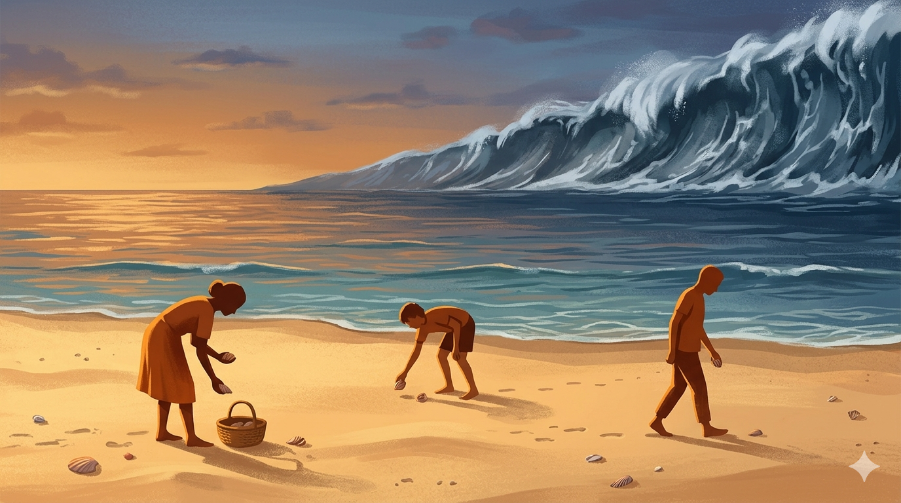
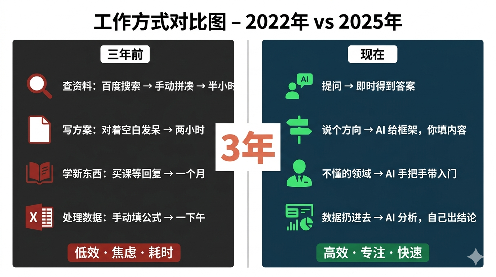
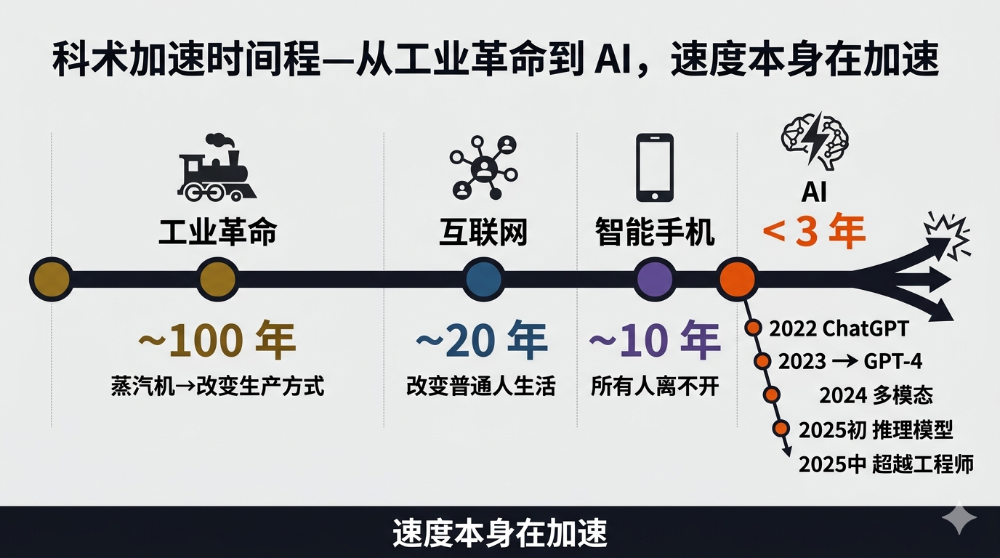
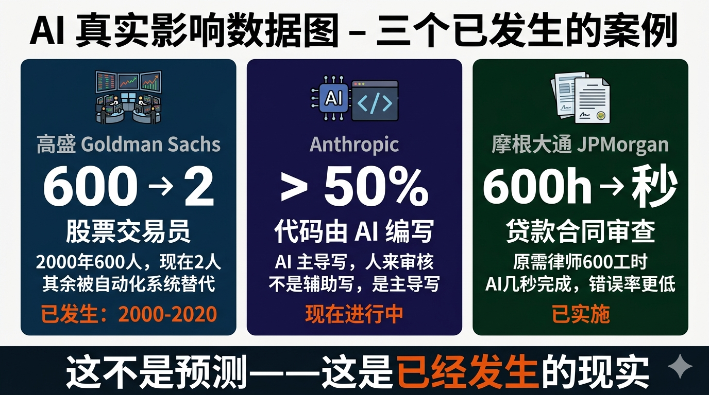
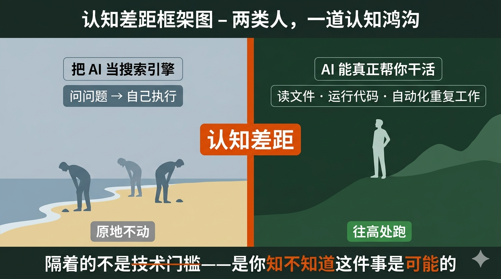

# 有人说，我们正在假装没看见一场海啸

_预计阅读时间：9分钟_

---

先给你讲一个细节。

Anthropic，就是做 Claude 的那家公司，他们的创始人 Dario Amodei 前不久说了一句话。

大意是这样的：

> 人们面对 AI 的态度，就像站在海滩上。远处，海啸已经清晰可见。但岸上的人们，还在继续捡贝壳。

我第一次看到这句话的时候，沉默了很久。

因为我意识到，就在两三年前，我自己也是那个捡贝壳的人。

---

## 你还记得三年前吗

我想让你做一件事。

闭上眼睛，想一想——2022年底，ChatGPT 还没出来的时候，你是怎么工作的？

查资料：打开百度，点进十几个网页，把有用的信息一条一条复制到文档里，拼凑成你想要的答案。半个小时过去了。

写方案：对着空白文档发呆，想开头，想结构，想怎么让领导觉得这个方案有深度。两个小时过去了。

学新东西：找课程、买书、加群问人，等别人回复，等自己消化。一个月过去了。

处理数据：打开 Excel，手动输公式，出了错找半天，最后发现是某个单元格多了个空格。一个下午过去了。

你现在还记得那种感觉吗？

那种对着屏幕不知道从何下手的感觉。那种花了三个小时却感觉什么都没做成的感觉。

---

现在呢？

你把问题丢给 AI，它给你答案。 你说个方向，AI 给你框架，你填内容。 你不懂的领域，AI 手把手带你入门。 你把数据扔进去，AI 自己分析，自己出结论。

**三年。就三年。**

你工作和学习的方式，已经发生了根本性的改变。

而你几乎没有意识到这件事有多不寻常。

---

## 这件事，在人类历史上从未发生过

我想让你感受一个数字。

工业革命，从蒸汽机发明到改变整个社会的生产方式，用了将近一百年。

互联网，从诞生到真正改变普通人的生活，用了大约二十年。

智能手机，从出现到让所有人离不开它，用了大约十年。

AI 呢？

- 2022年底：ChatGPT 发布，震惊世界
- 2023年：GPT-4，能力跃升，开始能帮人做真正有价值的工作
- 2024年：多模态成熟，AI 开始能看图、听声、读文件
- 2025年初：推理模型出现，AI 开始真正"思考"，而不只是"回答"
- 2025年中至今：AI 写代码的能力已经超过了大多数工程师

注意这个时间线。

从"震惊世界"到"超过大多数工程师"，**不到三年**。

但这还不是最让人震惊的部分。

最让人震惊的是速度本身在加速。

以前是按年迭代。后来是按月。现在是按周，甚至按天。

几乎每隔几天，就有新的突破。几乎每隔几周，就有某个"AI 做不到的事"被划掉。

**这在人类历史上，从未发生过。**

没有任何一项技术，以这种速度演进过。

---

## 顶尖的人，在说什么

这不是普通人在焦虑。

是那些最了解 AI 的人，在发出警告。

OpenAI 的 Sam Altman 说，他认为 AGI——也就是在大多数任务上超过人类的人工智能——可能在几年内到来。

Anthropic 的 Dario Amodei 写了一篇长文，标题叫《机器中的灵魂》。他说，他能想象在不远的未来，AI 能在几个月内压缩人类几十年才能完成的科学进展。

Google DeepMind 的负责人 Demis Hassabis，拿了2024年的诺贝尔化学奖。得奖原因：他的 AI 系统 AlphaFold，解决了困扰生物学界50年的蛋白质折叠问题。

这不是科幻小说里的情节。

这是2024年，真实发生的事。

---

而与此同时——

你身边有多少人，还在用豆包聊天解闷？

有多少人，听说过 Claude Code 这个东西？

有多少人，知道现在有一种 AI，不只是回答你的问题，而是能直接帮你操作文件、运行代码、自动完成你每天重复做的那些工作？

这个认知的落差，就是那片海滩。

聪明的人在远处看见了海啸，开始往高处跑。

大多数人，还在低头捡贝壳。

---

## 不是危言耸听，是已经发生的事

我知道有人看到这里会说：你在贩卖焦虑。

我想回应这个。

我说的不是"未来 AI 可能会怎样"。

我说的是**已经发生**的事。

Anthropic 的工程师团队，现在有超过50%的代码是由 AI 写的。不是辅助写，是 AI 主导写，人来审核。

高盛，2000年有600个股票交易员。现在只剩2个。其余的，被自动化系统替代了。这不是预测，这是十年前就发生完的事。现在 AI 在做的，是把这个替代浪潮推进到更多层级。

摩根大通，用 AI 来审查贷款合同。原来律师和合规团队需要600个工时完成的工作，AI 几秒钟搞定，而且错误率更低。

一个完全不会写代码的人，今天用 Claude Code，可以做出原来需要一个初级工程师才能做的东西。

这些不是预测。这些是正在发生的现实。

---

## 那普通人怎么办

我写这篇文章，不是为了让你焦虑。

焦虑没有用。

我写这篇文章，是因为我发现了一件事：

**认知的差距，才是最大的差距。**

不是能力的差距，不是资源的差距。是你知不知道这件事在发生，知不知道自己能做什么。

很多人用 AI，只是把它当一个更聪明的搜索引擎。问问题，得答案，然后自己去执行。

但实际上，现在的 AI 能做的远不止这些。它能帮你真正干活，不只是告诉你怎么干。它能读你的文件，运行代码，自动化你每天都要重复做的那些事。

这中间隔着的，不是技术门槛，不是需要你学编程。

隔着的，只是一个认知——**你知不知道这件事是可能的。**

---

## 我为什么要写这个号

我做这个公众号，就是为了填平这个认知差距。

不卖焦虑，不吹黑话。

我会告诉你：

- AI 时代正在发生什么，和你的工作、生活有什么真实的关系
- 现在最顶尖的 AI 工具能做什么，哪些是你不知道但应该知道的
- 普通人怎么真正用上这些工具，不是浅尝辄止，是真正改变工作方式
- 用 AI 做副业赚钱，哪条路是真实可行的，哪条是吹出来的
- Anthropic 每次发布新东西，对你意味着什么

我不假设你有技术背景。

我只假设你愿意认真对待这件事。

---

最后，我想把 Dario 那句话改一改，送给你：

> 海啸已经可见了。 你现在要做的，不是假装没看见，也不是站在原地发抖。 而是搞清楚：往哪个方向跑，怎么跑。

接下来，我们一起搞清楚。

---

**留一个问题给你：**

你现在有没有感受到 AI 对你工作或生活的影响？是哪方面？

或者，有没有什么事情，你一直觉得"AI 应该能帮我做"，但不知道从哪里开始？

**评论告诉我。下一篇，可能就从你的问题里来。**

---

_下篇预告：AI 已经击碎了哪些我们以为牢不可破的神话——创意、编程、专业知识、行业经验……下一个是什么？_

---

**关注我，我们一起往高处跑。**
