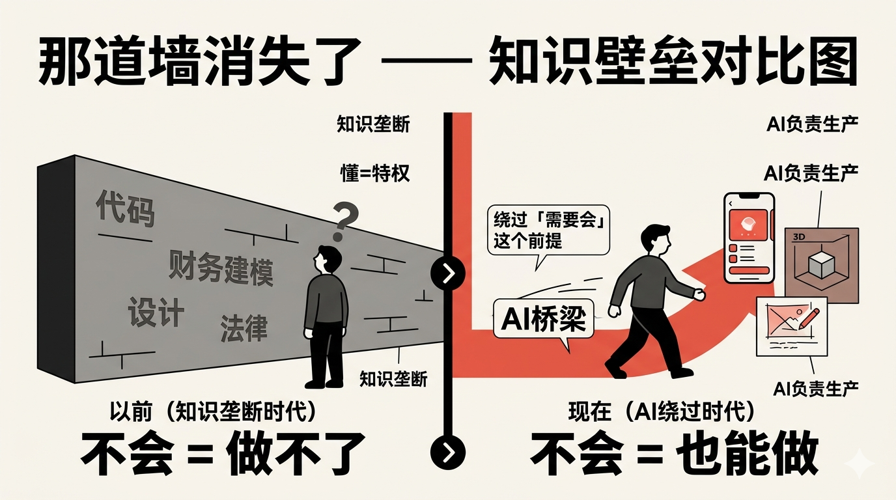
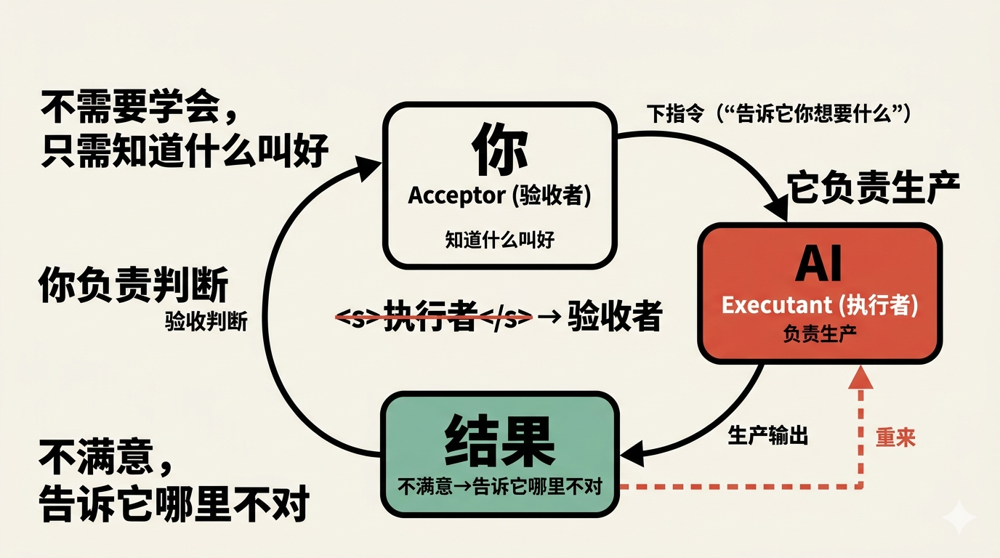
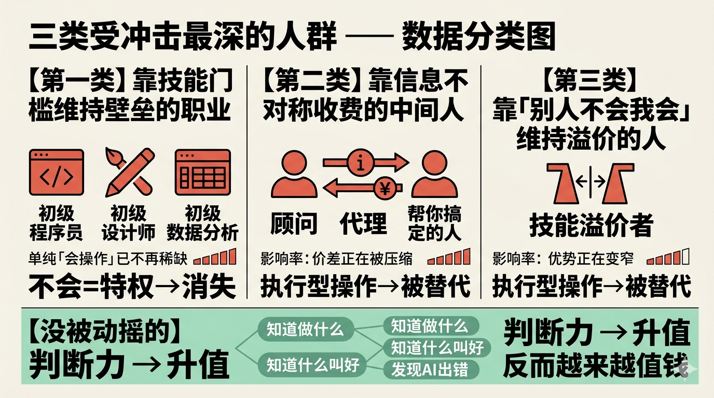
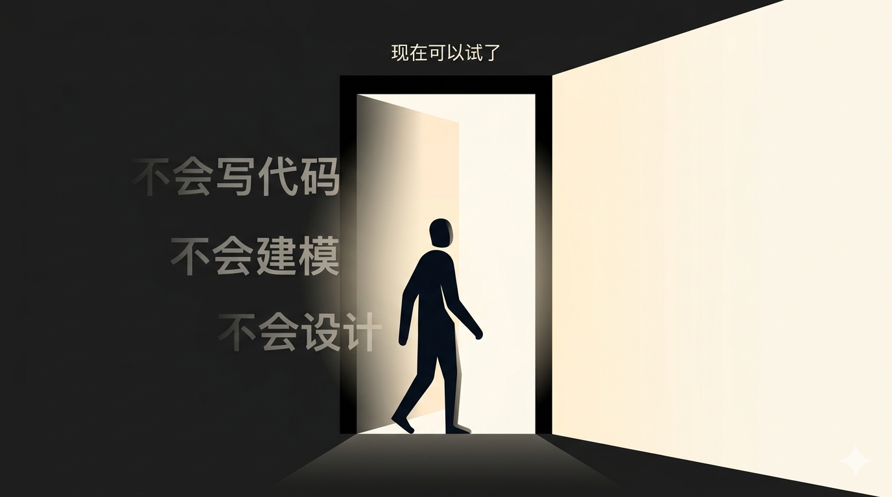

# 那道墙消失了

_预计阅读时间：8分钟_

---

我第一次做自己的 app，完全不懂后端。

不是"了解一点"，是真的不懂。数据库怎么设计、接口怎么写、服务器怎么部署——这些东西对我来说是一个黑盒。

以前遇到这种情况，我只有两个选择：去学，或者找人帮我做。

但那次我选了第三条路：直接开做，不懂的就问Claude Code。

它问我要什么，我说我要什么。它遇到问题，我说遇到了什么问题。我们就这么你来我往，几天后那个app真的跑起来了。

中间有很多地方我完全不理解发生了什么——我不知道它写的代码是什么逻辑，我不知道那个报错是什么原因。但我知道我要什么，我知道"好用了"和"没好用"的区别。

这就够了。

---

我想说的不是"Claude Code很厉害"。

我想说的是：那道墙，消失了。

---

## 以前那道墙是什么

以前的世界有一道硬墙。

不是学习曲线，不是"努力就能突破"的那种挑战。是真正意义上的能力门槛——你不会的东西，你做不了。

不会写代码，就没法开发产品。你脑子里有一个绝妙的想法，也只能停留在想法里，或者花钱花时间找人帮你做。

不会财务建模，就没法分析一家公司。那些看起来很厉害的估值模型、DCF分析，都是"别人的东西"，你只能看结论，不能自己算。

不会设计，就做不出专业视觉。你知道好看是什么感觉，但你做不出来。

这道墙的本质，是**知识垄断**。

懂某件事，等于掌握了做这件事的特权。不懂，就只能等别人。

---

## 现在这道墙消失了

我说"消失了"，不是说"学起来更容易了"。

不是"AI 帮你缩短了从不会到会的距离"。

是**绕过了"需要会"这个前提本身**。

你不需要学后端，也可以做出来一个后端能跑的 app。
你不需要学财务建模，也可以让 AI 帮你跑出一份有效的估值模型。
你不需要学设计，也可以让 AI 帮你生成一套真正能用的视觉方案。

你可能会想：但我不懂这些，我怎么知道它做得对不对？

这是一个好问题，也是真正的关键点。

你需要懂的，不是"怎么做"，而是"什么叫做好"。

这两件事是不一样的。

一个不懂烹饪的人，可以判断这道菜好不好吃——他不需要会做才能评价。

一个不懂法律的创业者，可以判断这份合同有没有明显坑——他不需要自己写才能确认没问题。

你的角色变了：从**执行者**变成了**验收者**。

AI 负责生产，你负责判断对不对。不满意，告诉它哪里不对，让它重来。这就是整个工作流。

---

## 谁受到冲击最大

这件事影响了所有人，但冲击最深的是三类人。

**第一类：靠技能门槛维持壁垒的职业。**

初级程序员、初级设计师、初级数据分析——这些岗位的核心价值，长期以来是"我会，你不会"。

现在"你不会"这个前提动摇了。

不是说这些职位消失了，而是说：单纯"会写代码"、"会用PS"、"会跑Excel"，已经不再是稀缺能力。

**第二类：靠信息不对称收费的中间人。**

某些顾问、某些代理、某些"帮你搞定"的人——他们的价值来自于你不懂、他懂。

这个价差正在被压缩。

**第三类：长期靠"别人不会我会"维持溢价的人。**

如果你现在的竞争优势，主要来自于掌握了某项别人不容易掌握的技能——这个优势正在变窄。

这不是说经验没价值了。

真正没被动摇的，是判断力：知道做什么、知道什么叫好、能在 AI 出错时发现问题。这些是 AI 替代不了的，反而越来越值钱。

动摇的，是纯执行型的"我会做这个操作"。

---

## 这对你意味着什么

如果你现在有一件事，一直因为"不会"而搁置着——

不会写代码所以没做那个工具，不会做财务模型所以没分析那家公司，不会设计所以没做那个产品——

现在可以试了。

不需要先学会，直接告诉 Claude 你想要什么结果。把背景说清楚，把目标说清楚，把"做好了长什么样"说清楚。

然后让它跑，你来判断。

相信我，你会惊讶于它能做什么。

---

**留一个问题给你：**

你有没有用 AI 做成过一件你以前根本不敢想的事？或者，你现在有哪件事一直因为"不会"而搁置着？

评论里告诉我。

---

_下篇预告：知道 AI 能做什么，只是第一步。很多人会用了，但用得很低效——每次都要反复追问、纠正、将就。高效用 AI 和低效用 AI，差的不是工具，是一个思维方式。下一篇，我来讲这个。_

---

**关注我，我们一起往高处跑。**
